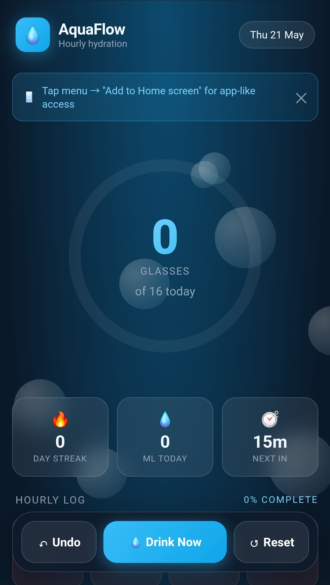
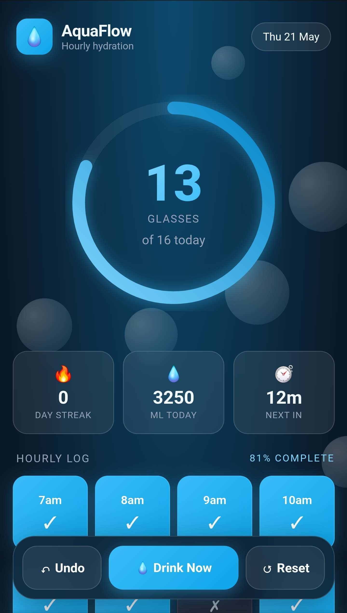
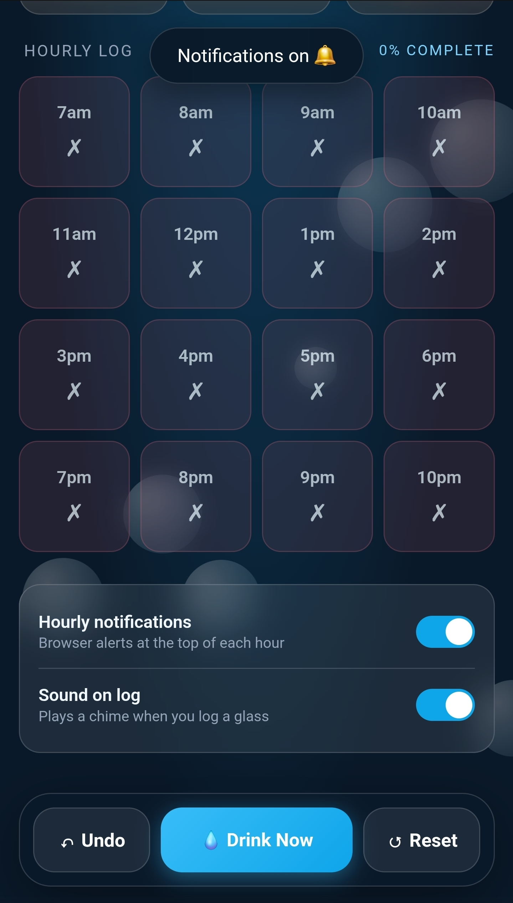

# 💧 AquaFlow — Hourly Water Habit Tracker

A beautiful, interactive, single-file hydration tracker that reminds you to drink water every hour. Built as a Progressive Web App (PWA) that runs in any modern browser and installs to your Android/iOS home screen like a native app.

> Stay hydrated, one hour at a time.

---

## 📸 Screenshots

<!-- Replace these placeholders with your actual screenshots -->

| Home Screen | Logged Progress | Notifications |
|:---:|:---:|:---:|
|  |  |  |

---

## ✨ Features

### Core Tracking
- **Hourly logging grid** — 16 hour cells from 7 AM to 10 PM, each representing one 250 ml glass
- **One-tap "Drink Now"** button logs the current hour instantly
- **Manual cell tapping** — log any hour retroactively or unlog mistakes
- **Undo button** — reverses the last 20 actions
- **Auto-reset at midnight** — fresh tracking starts each day
- **Persistent storage** — your progress survives browser refreshes via `localStorage`

### Visual Feedback
- **Animated progress ring** with gradient stroke that fills as you complete hours
- **Glassmorphic UI** with backdrop blur, gradient cards, and depth shadows
- **Floating background bubbles** drifting up continuously for a water-themed vibe
- **Current-hour pulse** — the active hour has a glowing gold ring so it's always obvious
- **State-based cell colors**:
  - 🔵 Blue gradient = logged glass
  - 🟡 Gold ring = current hour (waiting on you)
  - 🔴 Rose = missed past hour
  - ⚪ Faded = future hour
- **Splash animation** when you log a glass
- **Bouncing counter** that pops on every update

### Reminders & Alerts
- **Browser notifications** at the top of every hour (opt-in, requires HTTPS)
- **Persistent on-screen banner** when the current hour is unlogged
- **Live countdown** showing minutes until the next hour
- **Audio chime** via Web Audio API when you log a glass (toggleable)
- **Haptic vibration** on Android via `navigator.vibrate`

### Stats & Gamification
- **Day streak counter** — increments when you log 70%+ of hours
- **Daily ml total** — calculated at 250 ml per glass (4 L goal)
- **Completion percentage** — live updating
- **Confetti celebration** when you hit your full daily goal

### Settings
- **Hourly notifications toggle** (browser permission required)
- **Sound on log toggle**
- **Dismissable install hint** for first-time users

---

## 🎯 Use Cases

### 1. **Desk worker fighting dehydration**
You sit at a screen for 8+ hours and forget to drink. Pin AquaFlow as a browser tab; the on-screen banner and chime nudge you every hour without being annoying.

### 2. **Fitness & training routine**
Pair with a workout schedule to ensure consistent water intake throughout the day. The ml counter helps you hit specific hydration targets (e.g., 3-4 L for active days).

### 3. **Habit-building / accountability**
The streak counter and confetti reward create a small dopamine loop. Useful for anyone consciously trying to build hydration as a daily habit.

### 4. **Post-illness recovery / medical recommendation**
If a doctor has prescribed increased water intake (kidney stones, UTI prevention, low blood pressure), the structured hourly schedule prevents under-drinking.

### 5. **Hot climate / outdoor work**
For people in regions like Kerala or Andhra Pradesh during summer, hourly tracking guards against heat-related dehydration.

### 6. **Pregnancy or breastfeeding**
Increased hydration needs are easier to meet with a visual hourly grid.

### 7. **Replacement for sugary drinks**
Use the tracker as a behavior-substitution tool — every "logged glass" is a cup of water instead of a soda/coffee.

---

## 🚀 Getting Started

### Quick start (local)
1. Download `aquaflow.html`
2. Open it in any modern browser (Chrome, Firefox, Safari, Edge)
3. Start tapping! Progress saves automatically.

> ⚠️ **Note:** Opening as a local `file://` page means browser notifications won't work. For full features, host it on HTTPS.

### Recommended: Host on HTTPS for full PWA features

#### Option A — GitHub Pages (free, permanent)
```bash
# In a new repo
git init
git add aquaflow.html
git commit -m "Add AquaFlow"
git push origin main
# Enable Pages: Settings → Pages → Source: main branch
```
Your tracker is live at `https://<username>.github.io/<repo>/aquaflow.html`

#### Option B — Netlify Drop (instant, no account needed)
1. Visit [app.netlify.com/drop](https://app.netlify.com/drop)
2. Drag `aquaflow.html` into the page
3. Get a public HTTPS URL in seconds

#### Option C — Vercel
```bash
npx vercel deploy aquaflow.html
```

### Install on Android home screen
1. Open the HTTPS URL in **Chrome on Android**
2. Tap the **⋮ menu** → **Add to Home screen**
3. Confirm the name → installs with its own icon and splash
4. Launches fullscreen, like a native app

### Install on iOS home screen
1. Open the HTTPS URL in **Safari** (Chrome on iOS won't work for this)
2. Tap the **Share button** → **Add to Home Screen**
3. Confirm

### Install on desktop
1. Open the URL in Chrome/Edge
2. Click the **install icon** in the address bar (⊕ or computer-with-arrow)
3. Confirm install

---

## 🔔 Notifications Setup

Browser notifications require **HTTPS** (or `localhost` for testing). They will **not** work from a local `file://` path.

### If permission was denied:
**Android Chrome:**
- Tap the **lock/info icon** in the address bar → **Permissions** → **Notifications** → **Allow**
- Or: Chrome ⋮ → **Settings** → **Site settings** → **Notifications** → unblock the site

**Desktop Chrome/Edge:**
- Click the **lock icon** → **Site settings** → **Notifications** → **Allow** → reload

### Reliability caveat
Mobile browsers aggressively suspend background tabs to save battery. Hourly `setInterval` reminders may not fire reliably when the tab is backgrounded. For guaranteed hourly nudges, pair AquaFlow with:
- **Android Clock app** → set a repeating hourly alarm
- **Google Keep** → recurring time-based reminder
- **Tasker / MacroDroid** → automated hourly notification

Use AquaFlow as the *logging and visualization* layer; let the OS handle the *waking you up* part.

---

## ⚙️ Customization

All settings are at the top of the `<script>` block in `aquaflow.html`:

```javascript
const WAKE_START = 7;        // First tracked hour (7 AM)
const WAKE_END = 22;         // Last tracked hour (10 PM)
const ML_PER_GLASS = 250;    // ml per logged glass
```

Adjust to your routine. For example, a night-shift worker might use `WAKE_START = 15`, `WAKE_END = 6` (requires logic tweaks for wrap-around).

### Theme colors
CSS variables at the top of the `<style>` block:
```css
--accent: #38bdf8;     /* Primary blue */
--accent-2: #0ea5e9;   /* Deeper blue */
--gold: #fbbf24;       /* Current-hour highlight */
--rose: #fb7185;       /* Missed-hour color */
```

---

## 🛠️ Technical Details

- **Single HTML file** — no build step, no dependencies, no framework
- **~700 lines** of HTML + CSS + vanilla JavaScript
- **Storage:** `localStorage` (~1 KB used per day)
- **Audio:** Web Audio API (oscillator-generated chime, no audio files)
- **Vibration:** `navigator.vibrate` (Android only; iOS Safari blocks this)
- **Notifications:** Notifications API (requires HTTPS + user permission)
- **PWA manifest:** embedded as base64 data URI, no separate file needed
- **Offline-capable:** runs entirely client-side once loaded

### Browser compatibility
| Feature | Chrome Android | Safari iOS | Chrome Desktop | Firefox |
|---|---|---|---|---|
| Logging & UI | ✅ | ✅ | ✅ | ✅ |
| localStorage | ✅ | ✅ | ✅ | ✅ |
| Notifications | ✅ (HTTPS) | ⚠️ Limited | ✅ | ✅ |
| Vibration | ✅ | ❌ | ❌ | ✅ Android |
| Audio chime | ✅ | ✅ (after tap) | ✅ | ✅ |
| Add to Home Screen | ✅ | ✅ | ✅ | Partial |

---

## 📂 File Structure (suggested)

```
aquaflow/
├── aquaflow.html           # Main app (single file)
├── README.md               # This file
└── screenshots/            # Add your screenshots here
    ├── home.png
    ├── progress.png
    └── notification.png
```

---

## 🗺️ Roadmap Ideas

Potential enhancements if you want to extend it:

- [ ] Custom waking hours via UI (not just code)
- [ ] Weekly / monthly stats and charts
- [ ] Multiple drink types (water, tea, coffee with different hydration weights)
- [ ] Export data as CSV
- [ ] Dark / light theme toggle
- [ ] Multi-language support
- [ ] Wear OS companion
- [ ] Capacitor/Cordova wrapper for a true native APK
- [ ] Sync across devices via Firebase / Supabase
- [ ] Integration with Google Fit / Samsung Health

---

## 🐛 Known Limitations

1. **Background notifications are unreliable** on mobile browsers due to battery optimization.
2. **No cloud sync** — data is per-device, per-browser.
3. **No timezone migration** — if you travel across zones, the schedule shifts with the device clock.
4. **Streak logic is simple** — based on >70% completion of the previous day; missed days reset to 0.
5. **iOS audio** requires an initial user gesture before chimes will play (browser policy).

---

## 📜 License

Free to use, modify, and distribute. No attribution required, though appreciated.

---

## 🙏 Credits

Built as a personal habit-tracking experiment. Designed for mobile-first use with progressive enhancement on desktop.

---

**Made with 💧 — drink water, friend.**
